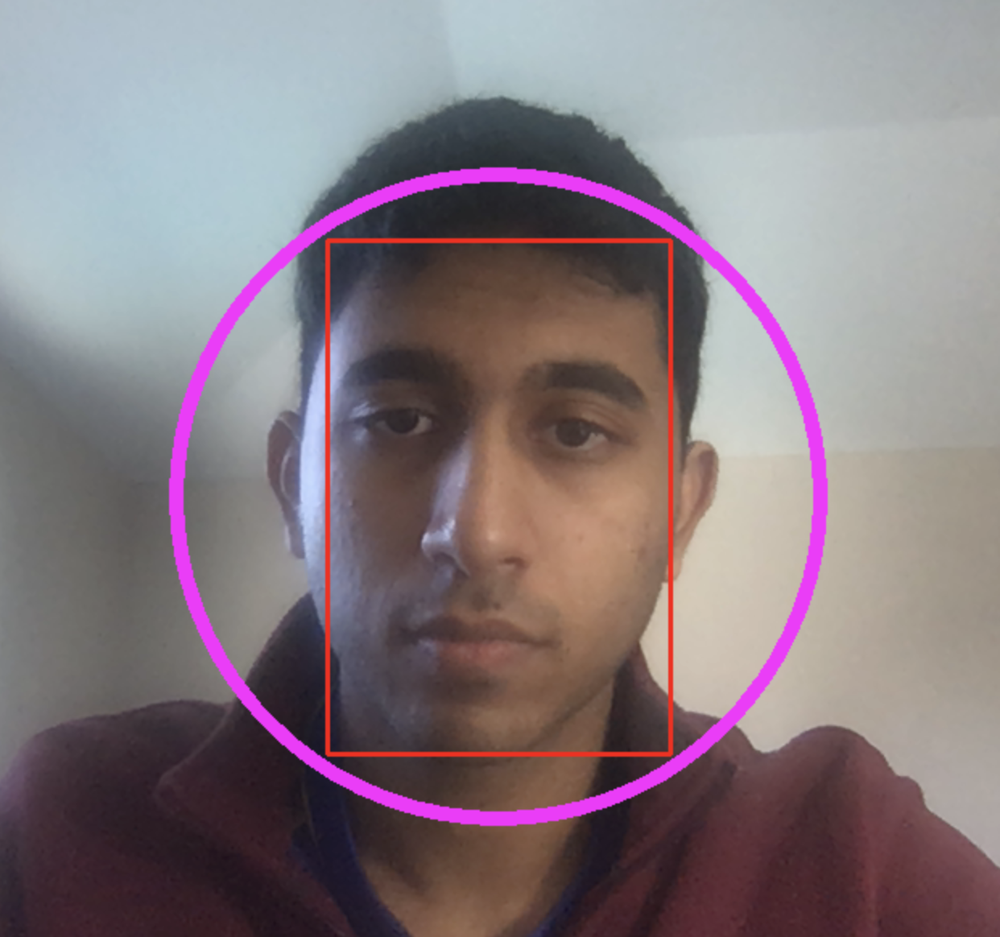

# Kronos

## Goals
The purpose of the project was to create a rotation invariant face-tracking application that could track faces regardless of orientation.
The project was divided into two parts: 1) Face Detection & 2) Tracking

The original application was made in Java, however, since the rest of the codebase depended upon other specific hardware that was being used at NASA,
I recreated the application to work on the FaceTime Camera of my MacBook (which unfortunately has a lot worse resolution).

## Face Detection
I researched many ways to do this in industry today. Initially, I used Haar Cascades as it seemed to be easily implementable, however the algorithm performs quite poorly with occlusion and in various orientations since it is specifically trained to detect a face from a direct frontal view (rotating the image multiple times for detection also makes the algorithm quite inefficient). Thus, I ended up using OpenCVs DNN module that has been trained specifically to
detect faces. This works quite well in various orientations and even with partial occlusions. However, I tend to run this detection step only over discrete intervals
of time as it computationally expensive.

## Face Tracking
As noted in the previous iteration, the face detection step was run over certain predetermined intervals of time. How did the algorithm track faces over these
intervals? The answer: a Kalman Filter. Through the adaptation of this [paper](https://www.sciencedirect.com/science/article/pii/S1877050911005126), I employed a
similar state space representation of the face. This makes the process a lot more efficient.

## Future Work
1) Detection: I'd like to try using AR tags and see how those compare to using the DNN.
2) Tracking: I'm still working on finding better ways to tune the covariance matrices of the KF.

Note: The red is the face detection and the pink is the actual tracker.
